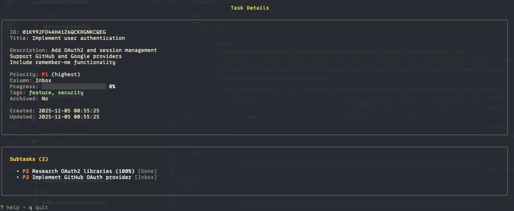
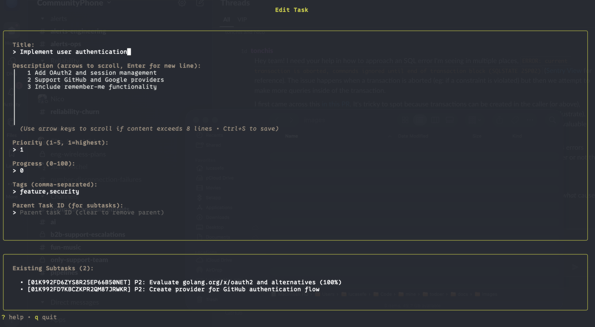

# OnTop - Dual-Mode Task Manager

<!--
  README Visual Content:
  To regenerate sample data for screenshots and CLI examples:
  1. Run: make build
  2. Run: ./scripts/generate-sample-data.sh
  3. This creates ./sample-tasks.db with 9 sample tasks (5 parents + 4 subtasks)
  4. Use for screenshots: ./ontop --db-path ./sample-tasks.db
  5. CLI examples in this README use actual output from the sample database
-->

A modern, flexible task management tool built in Go that works both as an interactive TUI (Terminal User Interface) and a traditional CLI.


## Features

- **Dual-Mode Interface**: Use as an interactive Kanban board TUI or run commands from the terminal
- **Flexible View Layouts**: Toggle between column (vertical Kanban) and row (horizontal stages) layouts
- **Kanban Workflow**: Organize tasks across columns (Inbox, In Progress, Done)
- **Hierarchical Subtasks**: Create and manage subtasks with visual indentation in both TUI and CLI
- **SQLite Storage**: Local database storage with automatic migrations
- **Rich CLI Commands**: Add, list, show, move, and update tasks from the command line
- **Terminal UI**: Beautiful, interactive Kanban board with vim-style navigation powered by Bubble Tea
- **Quick Move Actions**: Move tasks between workflow stages instantly with Shift+arrow keys
- **Multiline Descriptions**: Rich text descriptions with scrollable textarea support
- **Archive System**: Archive completed tasks to keep your workspace clean

## Quick Start Examples

### CLI Mode - List Tasks

View all tasks with hierarchical structure showing subtasks indented below their parents:

```bash
$ ./ontop list
```

```
Total: 9 tasks

[01K992C1WG3BVF7BB8KT7HJNWK] P1 | Inbox | Implement user authentication [feature, security]
  - [01K992C1YWF62NPWSX3Z4QPH9N] P2 | Done | Research OAuth2 libraries [research] (100%)
  - [01K992C1ZDNASWF94VTMJGH2J2] P2 | Inbox | Implement GitHub OAuth provider [development]
[01K992C1X5AA8WSAS78BAQT19Y] P2 | In Progress | Fix memory leak in task sync [bug, performance] (75%)
[01K992C1Y9J4CTJJM6HEAEZ68T] P2 | Done | Migrate to WAL mode for SQLite [infrastructure, database] (100%)
[01K992C1WT38XRQ26X29B78YMF] P3 | Inbox | Update API documentation [documentation] (25%)
[01K992C1XQGBPB77S8B6FK5FJW] P4 | In Progress | Add fuzzy search to task titles [feature, enhancement] (50%)
  - [01K992C1ZRYSEM9MHDW1NK9EJZ] P4 | Done | Evaluate fuzzy search algorithms [research] (100%)
  - [01K992C20A37DJXANDWV14CJRC] P4 | In Progress | Add search input to TUI [development, ui] (25%)
```

### CLI Mode - Show Task Details

View full details of a task including all subtasks and metadata:

```bash
$ ./ontop show 01K992C1WG3BVF7BB8KT7HJNWK
```

```
======================================================================
TASK: 01K992C1WG3BVF7BB8KT7HJNWK
======================================================================
Title:        Implement user authentication
Description:  Add OAuth2 and session management
Support GitHub and Google providers
Include remember-me functionality
Priority:     P1 (1=highest, 5=lowest)
Column:       Inbox
Progress:     0%
Archived:     false
Tags:         feature, security

Created:      2025-11-05 00:53:35
Updated:      2025-11-05 00:53:35

SUBTASKS (2):
----------------------------------------------------------------------
  - [01K992C1YWF62NPWSX3Z4QPH9N] P2 | Done | Research OAuth2 libraries (100%)
  - [01K992C1ZDNASWF94VTMJGH2J2] P2 | Inbox | Implement GitHub OAuth provider
======================================================================
```

### CLI Mode - Add Parent Task

Create a new parent task with metadata:

```bash
$ ./ontop add -title "Implement new feature" -priority 2 -description "Add user authentication" -tags "feature,security"
```

```
Created task 01K992C1WG3BVF7BB8KT7HJNWK: Implement new feature
```

### CLI Mode - Add Subtask

Create a subtask linked to a parent:

```bash
$ ./ontop add -title "Write unit tests for OAuth" -parent 01K992C1WG3BVF7BB8KT7HJNWK -priority 2 -tags "testing"
```

```
Created task 01K992DH9QE5VX7Z6FSCV63A36: Write unit tests for OAuth
```

## Features Showcase

### Task Detail View with Subtasks

View comprehensive task details including all subtasks, metadata, and multiline descriptions:



### Rich Task Editing

Edit tasks with a comprehensive form featuring multiline description support with scrollable textarea:



## Installation

### Build from source

```bash
# Clone the repository
git clone https://github.com/lucasefe/ontop.git
cd ontop

# Build the binary
make build

# Or install to $GOPATH/bin
make install
```

### Requirements

- Go 1.25.3 or later

## Usage

### Interactive TUI Mode

Launch the interactive Kanban board by running `ontop` without any arguments:

```bash
./ontop
```

In TUI mode, you can:
- Toggle between column (vertical Kanban) and row (horizontal stages) layouts (press 'v')
- Navigate tasks with vim-style keys - behavior adapts to current layout mode
- Quick move tasks between workflow stages with Shift+arrow keys
- View hierarchical task structure with subtasks indented below parents
- Create subtasks directly from detail view (press 'n' while viewing a task)
- View task details with multiline descriptions
- Move tasks between columns (press 'm')
- Edit tasks with rich form including multiline description support (press 'e')
- Archive/unarchive tasks (press 'a')
- Delete tasks with confirmation (press 'd')
- Sort tasks by priority, description, created, or updated date (press 's')
- Toggle between active and archived views (press 'z')

Your view layout preference is automatically saved to `~/.config/ontop/ontop.toml`.

### CLI Mode

Use traditional command-line commands for task management:

```bash
# Add a new task
./ontop add "Implement new feature" --priority 2 --description "Add user authentication"

# Add a subtask to an existing task
./ontop add "Write unit tests" --parent <parent-task-id> --priority 3

# List all tasks (shows hierarchical structure with subtasks indented)
./ontop list

# List tasks in a specific column
./ontop list --column inbox

# Show task details (includes all subtasks)
./ontop show <task-id>

# Move task to a different column
./ontop move <task-id> in_progress

# Update task attributes
./ontop update <task-id> --title "New title" --priority 2
```

### Available Commands

- `add` - Create a new task (supports `--parent` flag for subtasks)
- `list`, `ls` - List all tasks in hierarchical structure
- `show` - Show detailed information about a task including all subtasks
- `move`, `mv` - Move a task to a different column
- `update`, `edit` - Update task attributes
- `help` - Show help message

### TUI Keyboard Shortcuts

#### View & Navigation

- `v` - Toggle view layout (column ↔ row)
- `j/k` or `↓/↑` - Navigate tasks (context-sensitive)
  - **Column mode**: Move up/down within current column
  - **Row mode**: Move up/down within row and between rows
- `h/l` or `←/→` - Switch columns (column mode only)
- `Enter` - View task details / Select

#### Quick Move (Shift + Navigation)

- **Column Mode:**
  - `Shift+H` - Move task to previous workflow stage (left column)
  - `Shift+L` - Move task to next workflow stage (right column)
- **Row Mode:**
  - `Shift+K` - Move task to previous workflow stage (up row)
  - `Shift+J` - Move task to next workflow stage (down row)

#### Task Actions

- `n` - Create new task (in kanban) or subtask (in detail view)
- `e` - Edit selected task
- `m` - Move task to different column (interactive)
- `d` - Delete task (with confirmation)
- `a` - Archive/unarchive task
- `z` - Toggle archived view
- `s` - Cycle sort mode (priority/description/created/updated)
- `r` - Refresh task list

#### System

- `?` - Toggle help
- `q` or `Ctrl+C` - Quit
- `Esc` - Go back / Cancel
- `Tab` - Next form field (in create/edit forms)
- `Ctrl+S` - Save form (works from any field)

### Global Options

- `--db-path` - Specify custom database path (default: `~/.config/ontop/ontop.db`)

Example:
```bash
./ontop --db-path /path/to/custom.db list
```

### Configuration

OnTop stores user preferences in `~/.config/ontop/ontop.toml`:

```toml
[ui]
view_mode = "column"  # or "row"
```

The view layout preference is automatically saved when you toggle with the `v` key in TUI mode.

## Development

### Project Structure

```
cmd/ontop/          # Main application entry point
internal/
  cli/              # CLI command implementations
  models/           # Data models (Task, Column)
  service/          # Business logic and services
  storage/          # Database layer (SQLite)
  tui/              # Terminal UI components
tests/              # Test files
```

### Building and Testing

```bash
# Build the binary
make build

# Run tests
make test

# Run directly (TUI mode)
make run

# Clean build artifacts and database
make clean

# Show all available make targets
make help
```

### Technologies

- **Go 1.25.3** - Primary language
- **Bubble Tea** - Terminal UI framework
- **SQLite** - Local database
- **Lipgloss** - Terminal styling

## Database

OnTop uses SQLite for local storage. By default, the database is stored at `~/.config/ontop/ontop.db`.

The schema is automatically created and migrated on first run.

## Contributing

Contributions are welcome! Please feel free to submit issues and pull requests.

## License

[Add your license here]

## Author

Lucas Efe
